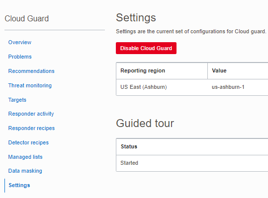
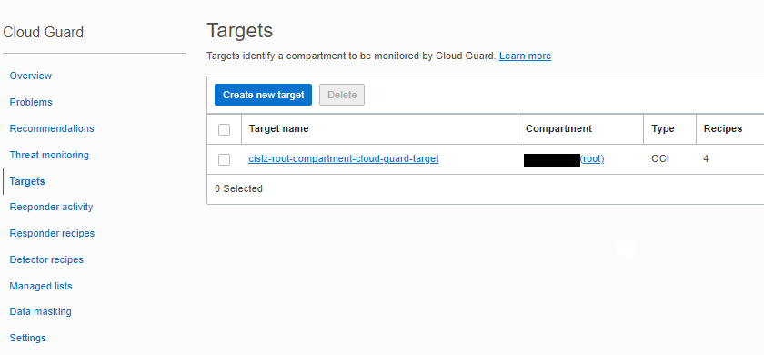
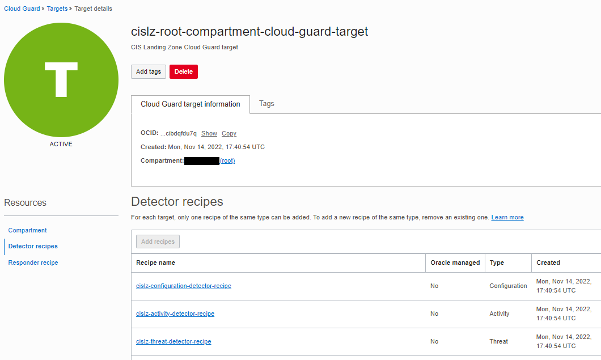
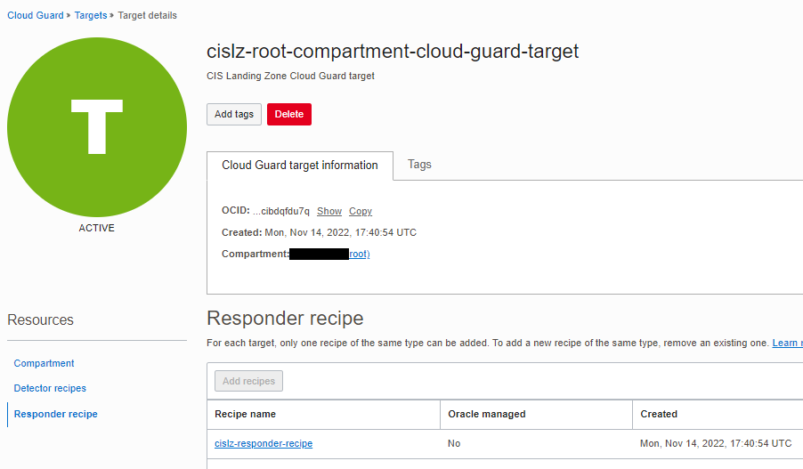

# OCI Cloud Guard Module Example - CIS Landing Zone

## Introduction

This example shows how to enable and manage Cloud Guard service resources in Oracle Cloud Infrastructure according to CIS OCI Benchmark requirement.

The following resources are created in this example:

- Cloud Guard service is enabled.
- One Cloud Guard target resource at the root compartment.
- Three custom detector recipes (configuration, activity and threat) cloned from Oracle managed detector recipes.
- One responder recipe cloned from Oracle managed responder recipe.

Here's how these resources appear in OCI Console:

### Service Enablement


### Target Resource


### Detector Recipes


### Responder Recipe


## Using this example
* Prepare one variable file named `terraform.tfvars` with the required IAM information. The contents of `terraform.tfvars` should look something like the following (or copy and re-use the contents of `terraform.tfvars.template`:

```
### TENANCY DETAILS
#
# Get this from OCI Console (after logging in, go to top-right-most menu item and click option "Tenancy: <your tenancy name>").
tenancy_id="<tenancy OCID>"
#
# Get this from OCI Console (after logging in, go to top-right-most menu item and click option "My profile").
user_id="<user OCID>"
#
# The fingerprint can be gathered from your user account. In the "My profile page, click "API keys" on the menu in left hand side).
fingerprint="<PEM key fingerprint>"
#
# This is the full path on your local system to the private key used for the API signing key pair.
private_key_path="<path to the private key that matches the fingerprint above>"
#
# This is the password that protects the private key, if any.
private_key_password=""
#
# This is your tenancy home region.
home_region="<your tenancy home region>"
```

Check the provided main.tf file. It calls the underlying tags module for resource management.

`main.tf`:

```
module "cislz_cloud_guard" {
  source = "../../"

  enable_cloud_guard = true
  tenancy_id         = var.tenancy_id
  compartment_id     = var.tenancy_id
  target_resource_id = var.tenancy_id
  reporting_region   = var.home_region
  name_prefix        = "cislz"
}

```

Then execute the example using the usual Terraform workflow:

```
$ terraform init
$ terraform plan
$ terraform apply
```